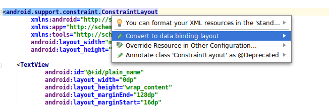

* [使用](#使用)
  * [第一步是在将使用它的模块中启用库](#第一步是在将使用它的模块中启用库)
  * [将布局转换为数据绑定布局](#将布局转换为数据绑定布局)
  * [创建第一个布局表达式](#创建第一个布局表达式)
  * [从活动中删除UI调用](#从活动中删除UI调用)
  * [处理用户事件](#处理用户事件)
  * [观察数据](#观察数据)
  * [使用绑定适配器创建自定义属性](#使用绑定适配器创建自定义属性)
  * [使用多个参数创建绑定适配器](#使用多个参数创建绑定适配器)


## 使用


* 将布局转换为数据绑定布局

  要将常规布局转换为数据绑定，您必须：

  * 用<layout>标签包裹您的布局
  * 添加布局变量（可选）
  * 添加布局表达式（可选）

  为了将布局转换为数据绑定，需要将根元素包装在<layout>标记中。您还必须将名称空间定义(以xmlns:开头的属性)移动到新的根元素。

  Android Studio提供了一种自动执行此操作的方法。打开布局文件，然后`ALT + ENTER`，快捷键会弹出菜单`Convert to data binding layout`。

  

  您的布局现在应如下所示：

  ```
  <layout xmlns:android="http://schemas.android.com/apk/res/android"
         xmlns:app="http://schemas.android.com/apk/res-auto"
         xmlns:tools="http://schemas.android.com/tools">
     <data>

     </data>
     <android.support.constraint.ConstraintLayout
             android:layout_width="match_parent"
             android:layout_height="match_parent">

         <TextView
  ...
  ```

  看看<data>标签。这就是我们放置布局变量的地方。

  布局变量用于编写布局表达式。布局表达式放在元素属性的值中，它们使用@{expression}格式。下面是一些例子:

  ```
  // Some examples of complex layout expressions
  android:text="@{String.valueOf(index + 1)}"
  android:visibility="@{age < 13 ? View.GONE : View.VISIBLE}"
  android:transitionName='@{"image_" + id}'
  ```

  > 布局表达式语言非常强大，但您应该只将它用于基本连接，因为更复杂的表达式会使其更难以阅读和维护。

  ```
  // Bind the name property of the viewModel to the text attribute
  android:text="@{viewModel.name}"
  // Bind the nameVisible property of the viewModel to the visibility attribute
  android:visibility="@{viewModel.nameVisible}"
  // Call the onLike() method on the viewModel when the View is clicked.
  android:onClick="@{() -> viewModel.onLike()}"
  ```

  布局编辑器中的预览窗格将显示数据绑定表达式的默认值。例如，预览窗格显示在下面的示例中声明的TextView小部件上的my_default值:

  ```
  <TextView android:layout_width="wrap_content"
      android:layout_height="wrap_content"
      android:text="@{user.firstName, default=my_default}"/>
  ```

  如果只需要在项目的设计阶段显示默认值，可以使用tools属性而不是默认表达式值。

  > 注意：布局表达式应保持小而简单，因为它们不能进行单元测试并且IDE支持有限。为了简化布局表达式，您可以使用自定义绑定适配器。


* 创建第一个布局表达式

  现在让我们从一些静态数据绑定开始。

  * 在<data>标记中创建两个字符串布局变量。

    ```
    <data>
        <variable name="name" type="String"/>
        <variable name="lastName" type="String"/>
    </data>
    ```

  * 查找ID为plain_name的TextView，并添加带有布局表达式的android:text属性:

    ```
    <TextView
          android:id="@+id/plain_name"
          android:text="@{name}"
    ... />
    ```

    布局表达式以@符号开头，并包含在花括号{}内。

  * 对plain_lastName文本视图执行相同的操作:

    ```
    <TextView
          android:id="@+id/plain_last_name"
          android:text="@{lastName}"
    ... />
    ```

    现在我们需要修改Activity，以便正确地扩展Data Binding布局。

* 从活动中删除UI调用

  布局已经准备好了，但是我们需要在活动中做一些更改。

  在onCreate，替换：

  ```
  setContentView(R.layout.plain_activity)
  ```

  为

  ```
  val binding : PlainActivityBinding =DataBindingUtil.setContentView(this, R.layout.plain_activity)
  ```

  我们为什么要创建变量？因为我们需要一种方法来设置我们在<data>块中声明的那些布局变量。这就是绑定对象的用途。绑定类由库自动生成。

  现在我们只需要设置变量值:

  ```
  binding.name = "Your name"
  binding.lastName = "Your last name"
  ```

  就是这样。您只需使用库绑定数据。我们可以开始删除旧代码。

* 处理用户事件

  到目前为止，我们已经研究了如何向用户显示数据，但是使用数据绑定库，您还可以处理用户事件和对布局变量调用操作。

  替换：

  ```
  android:onClick="onLike"
  ```

  为

  ```
  android:onClick="@{() -> viewModel.onLike()}"
  ```

  前一个onClick属性使用了一种不安全的机制，其中在onLike()单击视图时调用activity或fragment中的方法。如果不存在具有完全正确签名的方法，则应用程序崩溃。

  这种新方法更安全，因为它在编译时进行检查，并使用lambda表达式调用视图模型的onLike()方法。

  > 在Android Studio的Build菜单中单击“Make Project”检查数据绑定错误。问题将阻止应用程序的构建，错误将显示在构建日志中。

  现在让我们从活动中删除不需要的东西。

* 观察数据

  我们在前面的步骤中创建了一个静态绑定。如果打开视图模型，你会发现name和lastName只是字符串，这很好，因为它们不会改变。然而，like是由用户修改的。

  当这个值改变时，我们不是显式地更新UI，而是让它成为可观察的。

  通过数据绑定，当一个可观察值发生变化时，它绑定的UI元素将自动更新。

  实现可观察性有多种方法。您可以使用可观察类、可观察字段，或者首选的方法LiveData。

* 使用绑定适配器创建自定义属性

  当你将一个字符串(或一个可观察到的字符串)绑定到android:text属性时，很明显会发生什么，但它是如何发生的呢?

  使用数据绑定库，几乎所有的UI调用都是在称为绑定适配器的静态方法中完成的。

  此库提供了大量的绑定适配器。下面是android:text属性的一个例子:

  ```
  @BindingAdapter("android:text")
  public static void setText(TextView view, CharSequence text) {
    // Some checks removed for clarity
    view.setText(text);
  }
  ```

  或者android:background：

  ```
  @BindingAdapter("android:background")
  public static void setBackground(View view, Drawable drawable) {
      if (VERSION.SDK_INT >= VERSION_CODES.JELLY_BEAN) {
          view.setBackground(drawable);
      } else {
          view.setBackgroundDrawable(drawable);
      }
  }
  ```

  数据绑定没有什么神奇之处。所有问题都在编译时解决，您可以在生成的代码中阅读。

* 使用多个参数创建绑定适配器

  对于进度值，我们将使用一个绑定适配器，它接受最大值和喜欢的数量。打开BindingAdapters文件，找到这个:

  ```
  /**
   *  Sets the value of the progress bar so that 5 likes will fill it up.
   *
   *  Showcases Binding Adapters with multiple attributes.
   *  Note that this adapter is called whenever any of
   *  the attributes change.
   */
  @BindingAdapter("app:progressScaled", "android:max", requireAll = true)
  @JvmStatic fun setProgress(progressBar: ProgressBar, likes: Int, max: Int) {
      progressBar.progress = (likes * max / 5).coerceAtMost(max)
  }
  ```

  如果缺少任何属性，则不使用此绑定适配器。这发生在编译时。该方法现在接受3个参数(它应用于的视图+注释中定义的属性数量)。

  requireAll参数定义何时使用绑定适配器:

  如果为true，则所有元素都必须出现在XML定义中。
  如果为false，丢失的属性将为null，如果布尔值为false，如果原语为0，则为0。

  接下来，将属性添加到XML:

  ```
  <ProgressBar
          android:id="@+id/progressBar"
          app:hideIfZero="@{viewModel.likes}"
          app:progressScaled="@{viewModel.likes}"
          android:max="@{100}"
  ...
  ```

  我们将progressScaled属性绑定到like的数量，我们只是将一个文字整数传递给max属性。如果不添加@{}格式，数据绑定将无法找到正确的绑定适配器。