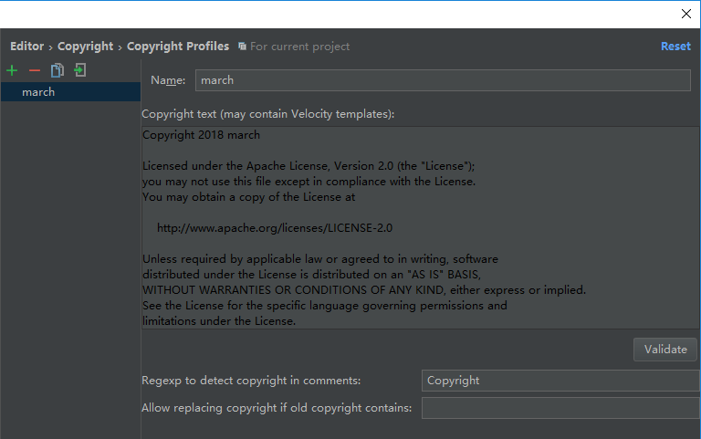

# Android Studio 配置 Copyright 插入版权声明

一个规范的项目无论是开源的还是公司内部，版权声明和协议声明都是不可少的。怎么给我们的 Android Studio 项目添加自定义的版权声明呢？

## 配置版权声明模板
- 选择File -> Settings

  

- 找到Editor -> Copyright，点击 Copyright Profiles
  

- 点击面板左侧的“+”图标，新建一个版权声明模板，输入版权声明名称
  

- 输入版权文本，你还可以在文本中使用一些变量
  

  > [APACHE LICENSE, VERSION 2.0 (CURRENT)][2]
  ```
  Copyright [yyyy] [name of copyright owner]

  Licensed under the Apache License, Version 2.0 (the "License");
  you may not use this file except in compliance with the License.
  You may obtain a copy of the License at

      http://www.apache.org/licenses/LICENSE-2.0

  Unless required by applicable law or agreed to in writing, software
  distributed under the License is distributed on an "AS IS" BASIS,
  WITHOUT WARRANTIES OR CONDITIONS OF ANY KIND, either express or implied.
  See the License for the specific language governing permissions and
  limitations under the License.
  ```
- 填写完后，点击 Validate 按钮，确保模板是有效的。如果有效，会弹出下面的提示
  

- 点击 Apply 按钮，应用这个模板
- 重新点击 Copyright ，在 default project copyright 中选择刚刚新建的版权模板名称，然后点击 Apply 按钮
  
- 点击 OK 按钮，回到刚刚操作的位置，点击面板右侧的“+”图标（第一次如果不点击 OK 按钮，“+”无法点击，后面不需要），弹出的下拉菜单 Scope 选择 All，Copyright 选择刚刚新建的版权模板名称
  

到此配置版权声明模板已经完成，下面开始使用版权声明模板

## 使用版权声明模板
#### 如果你新建一个文件，它会自动添加到文件的顶部

- 如图：
  

#### 怎么给现有的文件手动添加版权声明呢？

- 在文件顶部右键点击 弹出菜单 -> 选择Generate... ，如下图所示:
  
- 将会出现一个小窗口
  
- 点击 Copyright ，然后版权声明会添加到文件的最上面

#### 怎么给多个文件添加版权声明呢？

- 在项目任何文件夹右键点击 弹出菜单，选择 Update Copyright...
  
- 选择你需要添加版权声明的范围，这时候你可以选择整个项目
  

好了，大功告成！！！

[1]: https://github.com/maoqiqi/One/blob/master/md/Copyright.md
[2]: http://www.apache.org/licenses/LICENSE-2.0