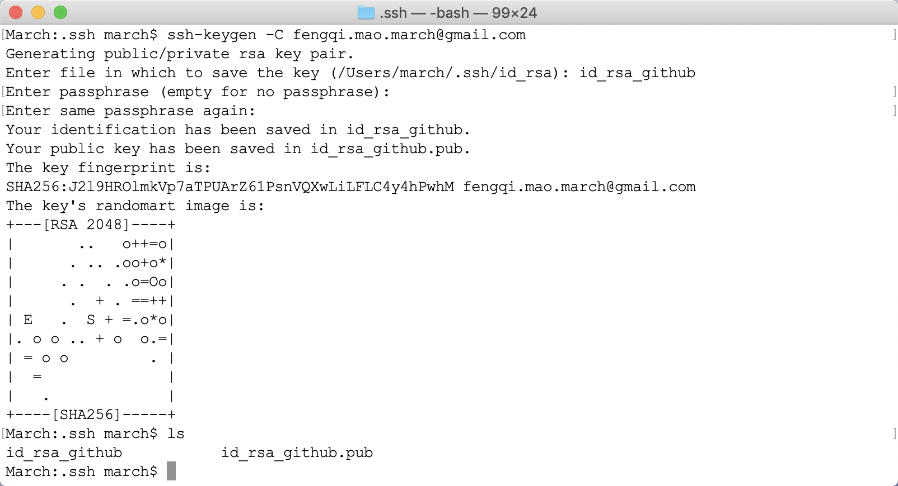
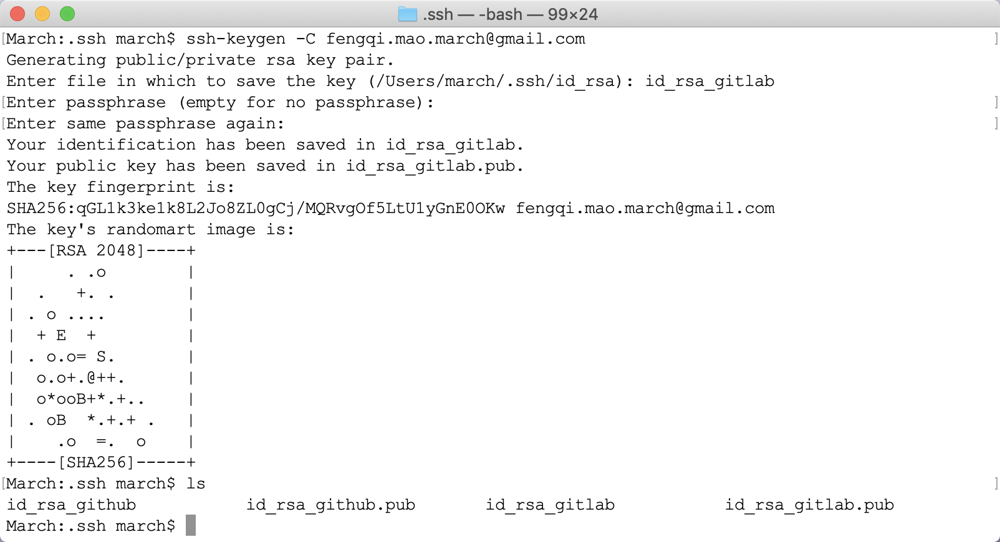
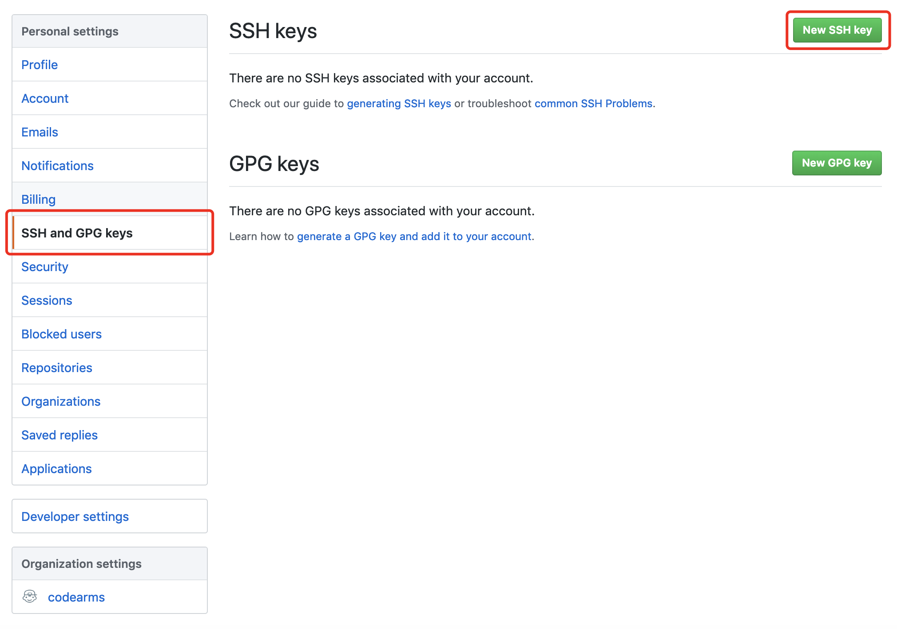
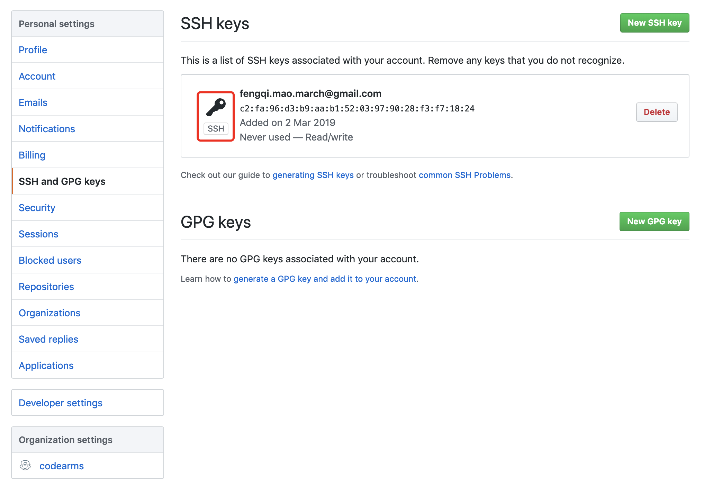
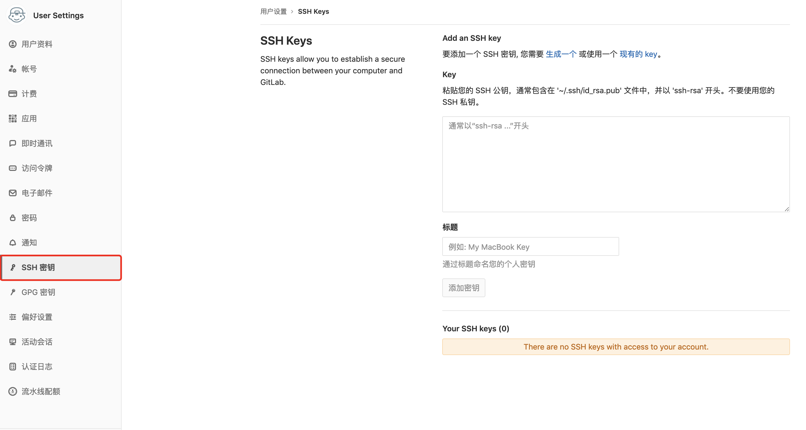
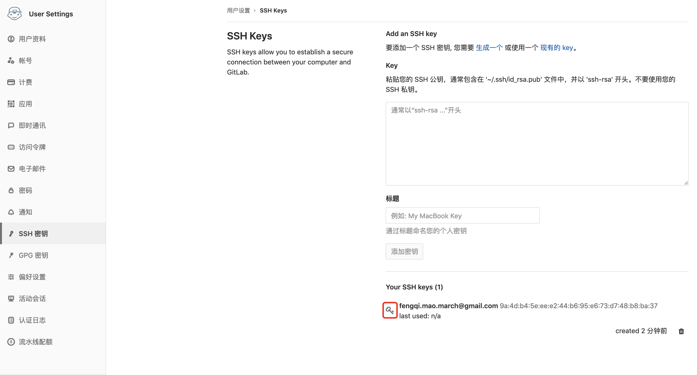
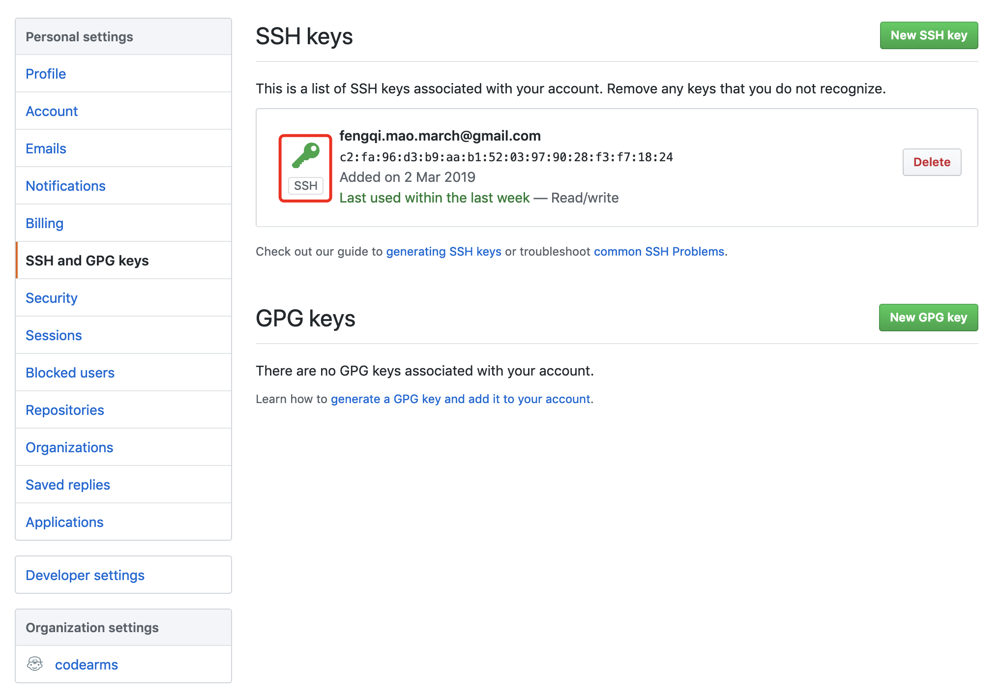
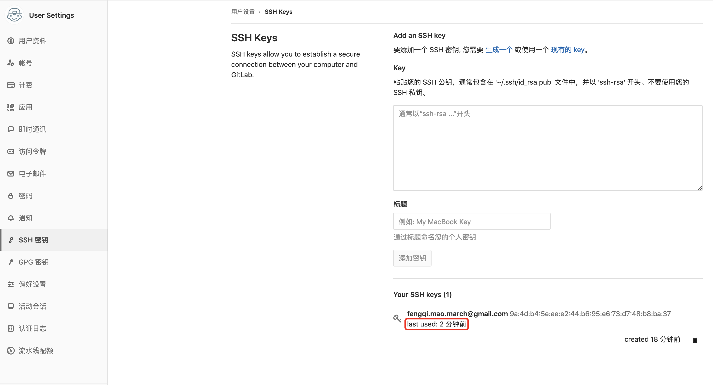

# SSH秘钥

## 目录

* [生成SSH秘钥](#生成SSH秘钥)
* [管理多个SSH公钥](#管理多个SSH公钥)
* [同一台电脑2个GitHub账号](#同一台电脑2个GitHub账号)


## 生成SSH秘钥

如前所述，许多Git服务器都使用SSH公钥进行认证。为了向Git服务器提供SSH公钥，如果某系统用户尚未拥有密钥，必须事先为其生成一份。这个过程在所有操作系统上都是相似的。
首先，你需要确认自己是否已经拥有密钥。默认情况下，用户的SSH密钥存储在其`~/.ssh`目录下。进入该目录并列出其中内容，你便可以快速确认自己是否已拥有密钥：

我们需要寻找一对以id_dsa或id_rsa命名的文件，其中一个带有.pub扩展名。.pub文件是你的公钥，另一个则是私钥。
如果找不到这样的文件（或者根本没有`.ssh`目录），你可以通过运行ssh-keygen程序来创建它们。

```
$ ssh-keygen
Generating public/private rsa key pair.
Enter file in which to save the key (/Users/march/.ssh/id_rsa):
Created directory '/Users/march/.ssh'.
Enter passphrase (empty for no passphrase):
Enter same passphrase again:
Your identification has been saved in /Users/march/.ssh/id_rsa.
Your public key has been saved in /Users/march/.ssh/id_rsa.pub.
The key fingerprint is:
SHA256:pEM3PyPze1olH0pPDyTyHvbiNS8iot3xMsMtduNrzlU march@March
```

首先`ssh-keygen`会确认密钥的存储位置（默认是`.ssh/id_rsa`），然后它会要求你输入两次密钥口令。如果你不想在使用密钥时输入口令，将其留空即可。

现在，进行了上述操作的用户需要将各自的公钥发送给任意一个Git服务器管理员（假设服务器正在使用基于公钥的SSH验证设置）。他们所要做的就是复制各自的.pub文件内容，并将其通过邮件发送。

常见参数设置：

* `-t`：指定要创建的密钥类型。可以使用："rsa1"(SSH-1)、"rsa"(SSH-2)、"dsa"(SSH-2)。如果没有指定则默认生成用于SSH-2的RSA密钥。
* `-C`：提供一个新注释。可以方便用户标识这个密钥，指出密钥的用途或其他有用的信息。所以在这里输入自己的邮箱或者其他都行。
* `-f`：指定密钥文件名。


## 管理多个SSH公钥

以前只使用一个SSH公钥在GitHub上提交代码，由于工作原因，需要再添加一个SSH公钥在公司的GitLab上提交代码，下面记录下配置过程，防止遗忘。

1. 生成github.com对应的秘钥

    执行命令`ssh-keygen -t rsa -C email`，创建github对应的SSH秘钥，命名为id_rsa_github。会生成id_rsa_github和id_rsa_github.pub两个文件。

    

    > 注意：不要一路回车，要给这个文件起一个名字，否则将覆盖上一次生成的SSH秘钥。

2. 同样的方法生成第二个gitlab.com对应的SSH秘钥

    同上给文件起一个名字，比如叫id_rsa_gitlab，所以相应的会生成id_rsa_gitlab和id_rsa_gitlab.pub两个文件。

    

    > 注意：邮箱地址可以相同可以不同，本文相同。

3. 在`.ssh`目录创建config文本文件并完成相关配置

    在`~/.ssh`目录下新建一个config文件。

    ```touch config```

    每个账号单独配置一个Host，每个Host要取一个别名，每个Host主要配置HostName和IdentityFile两个属性即可。

    * HostName：是目标主机的主机名，也就是平时我们使用ssh后面跟的地址名称。
    * IdentityFile：指定的私钥地址。
    * PreferredAuthentications：配置登录时用什么权限认证。(可设为publickey,password publickey,keyboard-interactive等)。
    * User：指定的登陆用户名。

    在config文件添加以下内容：

    ```
    # github
    Host github.com
        HostName github.com
        IdentityFile ~/.ssh/id_rsa_github
        PreferredAuthentications publickey

    # gitlab
    Host gitlab.com
        HostName gitlab.com
        IdentityFile ~/.ssh/id_rsa_gitlab
        PreferredAuthentications publickey
    ```

4. 把GitHub和GitLab对应的SSH公钥上传到服务器

    执行`cat id_rsa_github.pub`，查看GitHub的SSH公钥内容，将文本内容拷贝到 https://github.com/settings/ssh 。

    GitHub添加SSH公钥的方式如下图所示：

    

    

    执行`cat id_rsa_gitlab.pub`，查看GitLab的SSH公钥内容，将文本内容拷贝到 https://gitlab.com/profile/keys 。

    GitLab添加SSH公钥的方式如下图所示：

    

    

5. 测试

    执行`ssh -T git@github.com`测试GitHub是否连接成功。

    输出"Hi maoqiqi! You've successfully authenticated, but GitHub does not provide shell access."，就表示成功的连上GitHub了。

    执行`ssh -T git@gitlab.com`测试GitLab是否连接成功。

    输出"Welcome to GitLab, @maoqiqi!"，就表示成功的连上GitLab了。

    测试成功之后就可以在电脑上同时使用git多账号同时操作，互不影响了。

    > 注意：执行测试命令测试是否配置成，会自动在.ssh目录生成known_hosts文件把私钥配置进去。

6. clone代码

    使用SSH协议clone GitHub上的项目。使用SSH协议clone GitHub上的项目。

    上述都成功后，GitHub配置公钥的钥匙图标会由灰变绿，GitHub会显示最近一次使用时间。

    

    


## 同一台电脑2个GitHub账号

1. 生成2个GitHub账号对应的SSH公钥。
2. 配置config文件

    ```
    # github account [user1]
    Host github.com
    HostName github.com
    IdentityFile ~/.ssh/id_rsa_user1
    IdentitiesOnly yes
    User user1

    # github account [user2]
    Host github.com
    HostName github.com
    IdentityFile ~/.ssh/id_rsa_user2
    IdentitiesOnly yes
    User user2
    ```

3. 使用

    在使用时需要注意，不能设置全局的user.name和user.email

    取消全局user.name和user.email

    ```
    git config --global --unset user.name
    git config --global --unset user.email
    ```

    如要在repo中使用user1进行操作，进入repo目录后，先设置user.name和user.email，再进行其他操作。

    ```
    git config user.name "user1"
    git config user.email "user1@xx.mail"
    ```

    同样的，如果想在repo中切换为user2进行操作，则重新设置user.name和user.email（同上）后，再进行其他操作。
