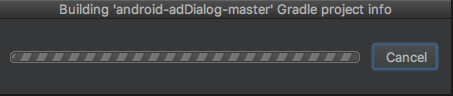
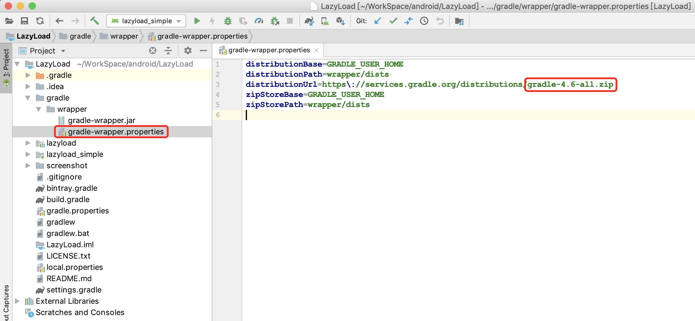
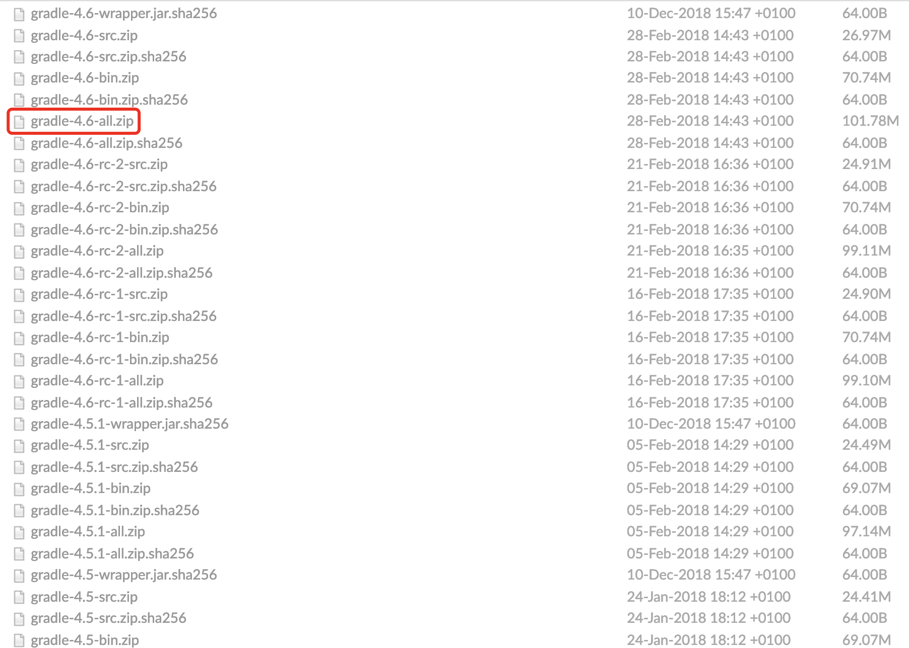
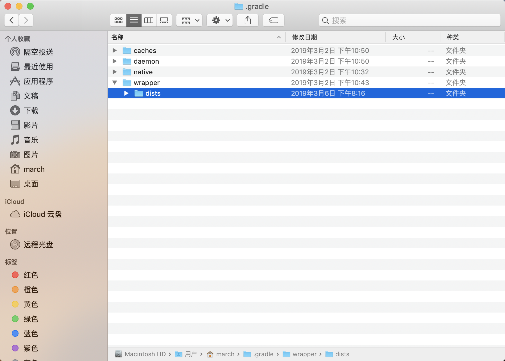
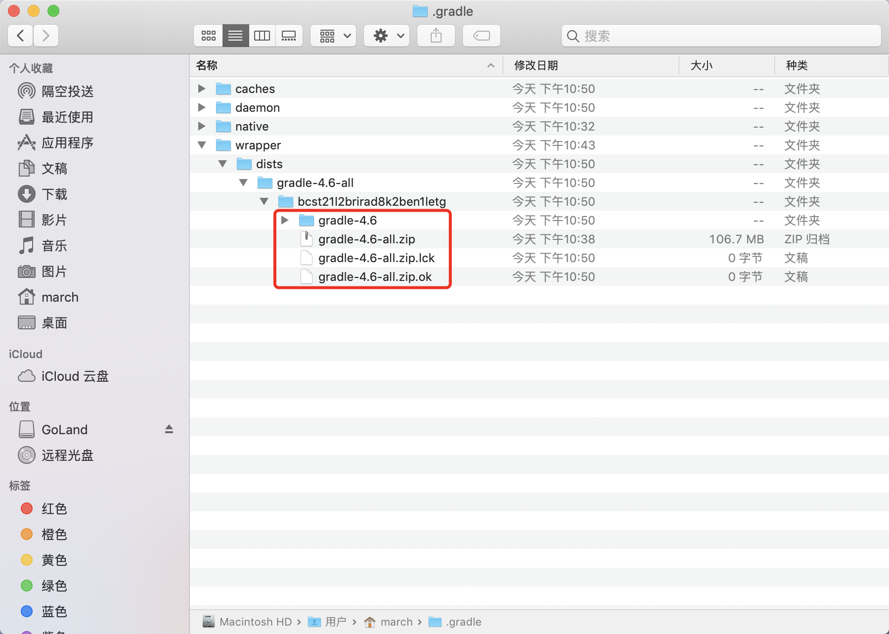

# Mac下Android Studio离线配置gradle

## 目录

* [概述](#概述)
* [配置](#配置)
  * [确认你需要的gradle版本](#确认你需要的gradle版本)
  * [下载指定版本的gradle](#下载指定版本的gradle)
  * [配置本地gradle](#配置本地gradle)
  * [重启](#重启)

## 概述

Android开发时，少不了学习人家的代码，例如在GitHub上下载了一个牛逼的项目，用Android Studio打开时，发现一直处于"Building 'XXX' Gradle project info"的情况。
如下图所示，等了好久，发现一直没有动静（从下文分析可知，是正在下载该项目指定版本的gradle，但是下载很慢）。于是试着点击了Cancel，然并卵，并不能取消building，最后只能强制关闭。

为什么会出现这种情况呢？

是因为，你的Android Studio中没有别人项目配置的gradle版本，所以Android Studio自动去下载别人项目的gradle版本了，然而由于国家安全需要，下载google的东西是很慢的，所以就一直处于building的状态了。

## 配置

### 确认你需要的gradle版本

打开"项目/gradle/wrapper/gradle-wrapper.properties"，即可查看当前项目配置的gradle版本，如下图所示：

### 下载指定版本的gradle

[http://services.gradle.org/distributions](http://services.gradle.org/distributions)，进入下载页，找到你需要的对应的版本，下载即可。

### 配置本地gradle

输入`open .gradle`，如下图所示：

如果你之前打开Android Studio但是因为gradle下载的原因（因为导入项目需要检测它）半天都进不去，你的目录现在可能是这样的。

> 注：gradle-x-x可能不一样，一长串的字符串也不一样（这个是随机的）。

把一长串的字符串的目录里面的东西都删掉，把下载的`gradle-4.6-all.zip`拷贝进去。

### 重启

重新启动Android Studio。