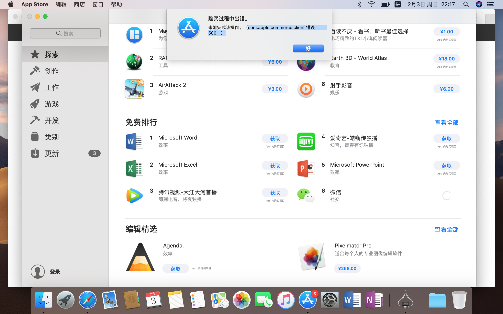
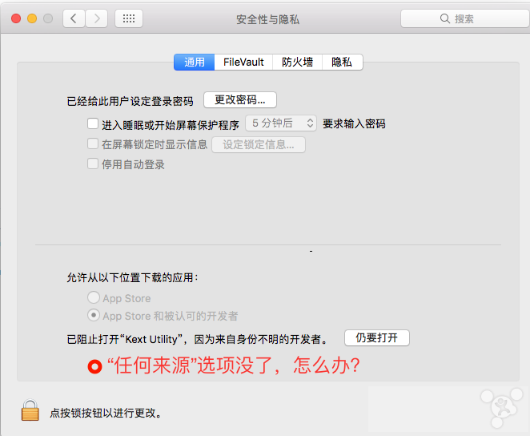
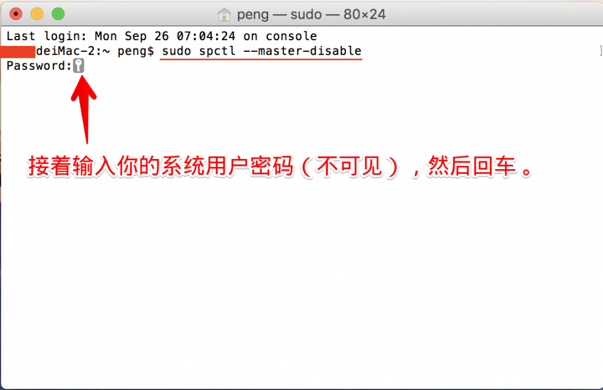
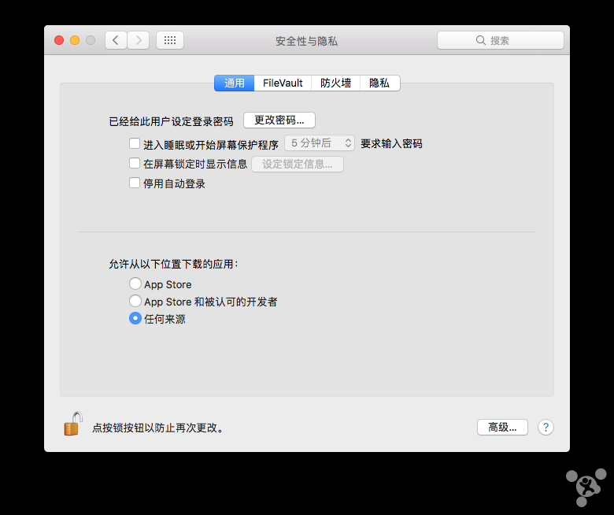

# Mac 常见问题

## 目录

* [AppStore不能下载应用](#AppStore不能下载应用)
* [finder没有显示个人用户文件夹](#finder没有显示个人用户文件夹)
* [Mac如何修改用户名和用户文件夹](#Mac如何修改用户名和用户文件夹)
* [Mac键盘上的Windows按键介绍](#Mac键盘上的Windows按键介绍)
* [Mac修饰键](#Mac修饰键)
* [Mac打不开pkg因为它来自身份不明的开发者](#打不开pkg因为它来自身份不明的开发者)
* [Mac允许从任何来源下载应用](#Mac允许从任何来源下载应用)

## AppStore不能下载应用

点击下载输入密码后，提示：购买过程中出错，未能完成该操作。（com.apple.commerce.client 错误 500。）

* 打开“启动台”->打开“其他”->打开“终端”。
* 复制粘贴`defaults delete com.apple.appstore.commerce Storefront`这段代码，不要作任何更改，哪怕是多余的空格出现。
* 回车，重启后，再利用AppleId登录app store即可。

如果上述步骤，未能解决该问题，建议联系技术支持部门。

## finder没有显示个人用户文件夹

finder->偏好设置->边栏->用户名打勾。

## Mac如何修改用户名和用户文件夹

打开终端

1. 输入`sudo su`回车
2. 输入登录密码（必须有密码才能执行）
3. 输入`cd /Users`回车
4. 例：输入`mv apple wind`回车。apple就是你原来的个人目录名称（短名称），wind是你想修改的名称。

    > 注：短名称必须全部小写、无空格且只包含字母。

    这时你会发现在Finder里没有桌面、下载等等文件夹了，不要慌，因为原来的个人目录名称被修改了，电脑无法识别了。开始下一步。

5. 使用“系统偏好设置”的“用户与群组(Users & Groups)”面板，来创建一个具有上一步骤中所使用的帐户名称或短名称的新用户。

    当系统提示“‘用户’文件夹中已经有名称为‘帐户名称’的文件夹。您想将该文件夹用作此用户帐户的个人文件夹吗？”时，点按“好”。

    > 注：这将更正个人文件夹中所有文件的所有权，并避免文件夹内容出现权限问题。

7. 注销电脑。
8. 以新创建用户的身份登录（提示钥匙串问题点击更新钥匙串）。您应该能够访问（桌面上、文稿中及该个人目录下其他文件夹中的）所有原始文件。
9. 验证您的数据是否正常后，可通过“用户与群组”面板删除原始用户帐户。

    如果你发现有些文件夹无法访问提示无权限，右键文件夹->显示简介->共享与权限，
    点击右下角小锁（密码应该是无，直接回车就可以了）点+号添加你改名的管理员账号，接着权限改成读与写即可。

## Mac键盘上的Windows按键介绍

* Windows按键Control在Mac键盘上相当于Command键。
* Windows按键Alt在Mac键盘上相当于Option键。
* Mac键盘上只有一个delete删除键，删除的是光标前一个字符，如果想实现Windows按键del删除后一个字符的功能，需要Fn+Delete组合。
* Mac键盘上没有Windows按键Home和End，前往当前行的开头或结尾需要使用Command+左箭头键和Command+右箭头键。
* Windows按键F1-F12使用时要配合FN使用，而Mac键盘上是直接使用的。

## Mac修饰键

## Mac打不开pkg因为它来自身份不明的开发者

**问题**：在安装从别的地方下载来的Mac软件如office时，有可能安装不上，原因是系统默认设置了只能安装Mac App Store和被认可的开发者的程序，因此只需要改变这一设置，就可以顺利安装了。

**方法**：系统偏好设置->安全性与隐私->通用->点击通用页面左下角锁的图标->弹框中输入密码(设置的密码不可以为空)->点击通用页面下方的“允许从以下位置下载的应用程序”下的“任何来源”选项。

## Mac允许从任何来源下载应用

苹果在2016年最新发布了macOS Sierra 10.12系统，可能好多小伙伴在升级后，发现系统偏好设置的“安全性与隐私”中默认已经去除了允许“任何来源”选项。
以往我们在Mac上安装一些未被认可来源的内容时需要打开“安全性与隐私”中的“任何来源”选项，否认一些第三方的应用可能会无法成功安装。
在这里简单介绍下如何为macOS Sierra找回“任何来源”的操作方法，希望可以帮到大家。

那么接下来我们就来看看如何恢复“任何来源”的选项：

1. 如果需要恢复允许“任何来源”的选项，即关闭Gatekeeper，请打开终端输入命令`sudo spctl --master-disable`。

    

2. 接着输入你的系统用户密码（不可见），然后回车。

    

3. 这样久违的“任何来源”选项就回来了。

    

    需要说明的是，如果在系统偏好设置的“安全性与隐私”中重新选中允许Mac App Store和被认可的开发者，即重新打开Gatekeeper后，允许“任何来源”选项会再次消失，可运行上述命令再次关闭Gatekeeper。

虽然这个方法是可以打开系统的“任何来源”选项，可以运行所有其它第三方应用程序，但同时也是有一定的风险的。
所以建议大家平时还是选择从Mac App Store 和被信任的开发者中运行程序，在必要的时候才将其打开。