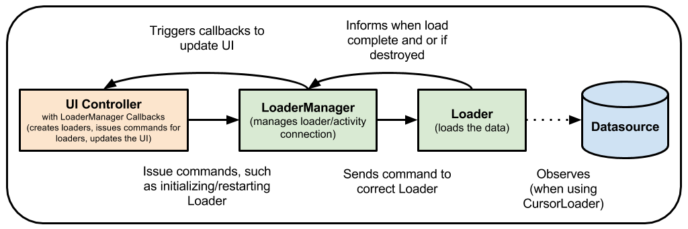

# ViewModel

ViewModel类旨在以生命周期有意识的方式存储和管理用户界面相关的数据。ViewModel类允许数据在配置更改(如屏幕旋转)之后存活。


## 目录

* [概述](#概述)
* [实现ViewModel](#实现ViewModel)
* [ViewModel的生命周期](#ViewModel的生命周期)
* [在片段之间共享数据](#在片段之间共享数据)
* [用ViewModel替换加载器]
* [更多的信息](#更多的信息)


## 概述

Android框架管理UI控制器的生命周期，例如活动和片段。框架可以决定销毁或重新创建UI控制器以响应某些完全不受您控制的用户操作或设备事件。

如果系统销毁或重新创建UI控制器，则存储在其中的任何瞬态UI相关数据都将丢失。例如，您的应用可能会在其中一项活动中包含用户列表。为配置更改重新创建活动时，新活动必须重新获取用户列表。
对于简单的数据，该活动可以使用onSaveInstanceState()方法，并从onCreate()中的bundle中恢复其数据，
但此方法仅适用于可以序列化然后反序列化的少量数据，而不适用于潜在的大量数据，如用户列表或位图。

另一个问题是UI控制器经常需要进行可能需要一些时间才能返回的异步调用。UI控制器需要管理这些调用并确保系统在销毁后清理它们以避免潜在的内存泄漏。
此管理需要大量维护，并且在为配置更改重新创建对象的情况下，由于对象可能必须重新发出已经进行的调用，因此浪费资源。

活动和片段等UI控制器主要用于显示UI数据、响应用户操作或处理操作系统通信(如权限请求)。要求UI控制器也负责从数据库或网络加载数据，会使类膨胀。
将过多的责任分配给UI控制器可能导致一个类试图独自处理应用程序的所有工作，而不是将工作委托给其他类。以这种方式将过多的责任分配给UI控制器也会使测试变得更加困难。

将视图数据所有权从UI控制器逻辑中分离出来更容易也更有效。


## 实现ViewModel

Architecture Components为负责为UI准备数据的UI控制器提供ViewModel帮助程序类。ViewModel在配置更改期间会自动保留对象，以便它们保存的数据可立即用于下一个活动或片段实例。
例如，如果您需要在应用中显示用户列表，请确保将获取和保存用户列表的责任分配给ViewModel，而不是activity或fragment，如下面的示例代码所示:

```
public class MyViewModel extends ViewModel {
    private MutableLiveData<List<User>> users;
    public LiveData<List<User>> getUsers() {
        if (users == null) {
            users = new MutableLiveData<List<User>>();
            loadUsers();
        }
        return users;
    }

    private void loadUsers() {
        // Do an asynchronous operation to fetch users.
    }
}
```

然后，您可以从活动中访问列表，如下所示：

```
public class MyActivity extends AppCompatActivity {
    public void onCreate(Bundle savedInstanceState) {
        // Create a ViewModel the first time the system calls an activity's onCreate() method.
        // Re-created activities receive the same MyViewModel instance created by the first activity.

        MyViewModel model = ViewModelProviders.of(this).get(MyViewModel.class);
        model.getUsers().observe(this, users -> {
            // update UI
        });
    }
}
```

如果重新创建活动，它将接收由第一个活动创建的相同MyViewModel实例。当owner活动完成时，框架调用ViewModel对象的onCleared()方法，以便清理资源。

> 注意：ViewModel决不能引用视图，Lifecycle或任何可能包含对活动上下文引用的类。

ViewModel对象被设计为比视图的特定实例更长久 LifecycleOwners。这种设计还意味着您可以编写测试来更容易地覆盖视图模型，因为它不知道视图和生命周期对象。
ViewModel 对象可以包含 LifecycleObservers，例如 LiveData对象。但是， ViewModel对象必须永远不会观察到生命周期感知的可观察LiveData对象（例如对象）的更改。
如果ViewModel需要应用程序上下文，例如查找系统服务，它可以扩展AndroidViewModel类，并在构造函数中有一个接收应用程序的构造函数，因为应用程序类扩展了上下文。


## ViewModel的生命周期

ViewModel对象的作用域是在获取ViewModel时传递给ViewModelProvider的Lifecycle。
ViewModel一直保存在内存中，直到它的作用域永久消失:对于活动，当它结束时，而对于片段，当它被分离时。


通常在系统第一次调用活动对象的onCreate()方法时请求一个ViewModel。系统可以在活动的整个生命周期中多次调用onCreate()，例如当设备屏幕旋转时。
从您第一次请求ViewModel到活动完成并销毁，ViewModel一直存在。


## 在片段之间共享数据

活动中的两个或多个片段需要相互通信是很常见的。想象一下主细节片段的常见情况，其中有一个片段，其中用户从列表中选择一个项目，另一个片段显示所选项目的内容。
这种情况绝不是微不足道的，因为两个片段都需要定义一些接口描述，而owner活动必须将两者绑定在一起。此外，两个片段都必须处理另一个片段尚未创建或不可见的场景。

这个常见的痛点可以通过使用ViewModel对象来解决。这些片段可以共享一个视图模型，使用它们的活动范围来处理这种通信，如下面的示例代码所示:

```
public class SharedViewModel extends ViewModel {
    private final MutableLiveData<Item> selected = new MutableLiveData<Item>();

    public void select(Item item) {
        selected.setValue(item);
    }

    public LiveData<Item> getSelected() {
        return selected;
    }
}


public class MasterFragment extends Fragment {
    private SharedViewModel model;
    public void onCreate(Bundle savedInstanceState) {
        super.onCreate(savedInstanceState);
        model = ViewModelProviders.of(getActivity()).get(SharedViewModel.class);
        itemSelector.setOnClickListener(item -> {
            model.select(item);
        });
    }
}

public class DetailFragment extends Fragment {
    public void onCreate(Bundle savedInstanceState) {
        super.onCreate(savedInstanceState);
        SharedViewModel model = ViewModelProviders.of(getActivity()).get(SharedViewModel.class);
        model.getSelected().observe(this, { item ->
           // Update the UI.
        });
    }
}
```

注意，这两个片段都检索包含它们的活动。这样，当每个片段获得ViewModelProvider时，它们将接收相同的SharedViewModel实例，该实例的作用域为该活动。

这种方法具有以下优点：

* 活动不需要做任何事情，也不需要知道关于此通信的任何信息。
* 除了SharedViewModel契约之外，片段之间不需要了解彼此。如果其中一个碎片消失了，另一个碎片会像往常一样继续工作。
* 每个片段都有自己的生命周期，不受另一个片段生命周期的影响。如果一个片段替换了另一个片段，UI将继续正常工作。


## 用ViewModel替换加载器

像CursorLoader这样的加载器类经常用于保持应用程序UI中的数据与数据库同步。您可以使用ViewModel和其他一些类来替换加载器。
使用ViewModel将UI控制器与数据加载操作分离开来，这意味着类之间的强引用更少。

在使用加载器的一种常见方法中，应用程序可能使用CursorLoader来观察数据库的内容。当数据库中的值发生变化时，加载器会自动触发数据的重载，并更新UI:



ViewModel与Room和LiveData一起工作来替换加载器。视图模型确保数据在设备配置更改后仍然存在。
当数据库发生更改时，Room会通知您的LiveData，而LiveData反过来又用修改后的数据更新您的UI。


## 更多的信息

随着数据变得越来越复杂，您可能会选择使用一个单独的类来加载数据。ViewModel的目的是封装UI控制器的数据，使数据在配置更改后仍然存在。
有关如何跨配置更改加载、持久化和管理数据的信息，请参阅保存UI状态。

Android应用程序架构指南建议构建一个存储库类来处理这些功能。